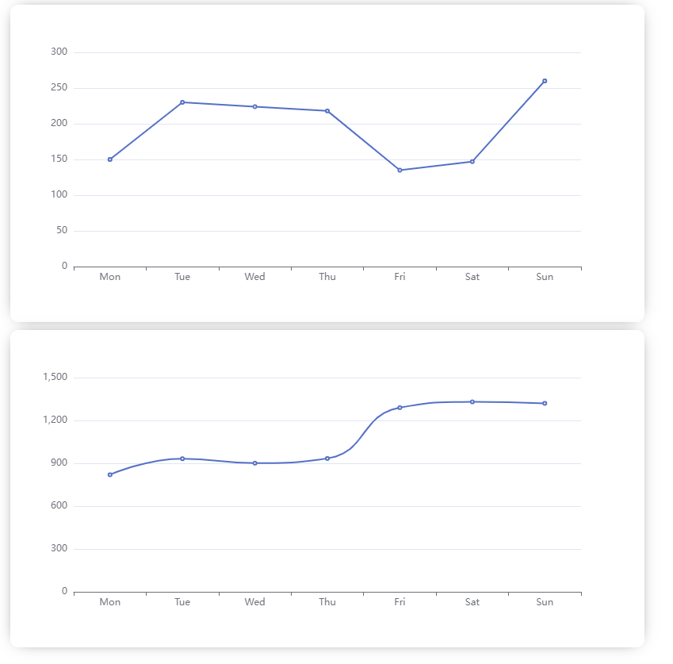

# Vue 3 + TypeScript + Vite + ECharts

暂时做了一些图表的测试  

  


## ECharts

>官方文档：[https://echarts.apache.org/zh/index.html](https://echarts.apache.org/zh/index.html)

### 安装👇
```shell
npm install echarts --save
```